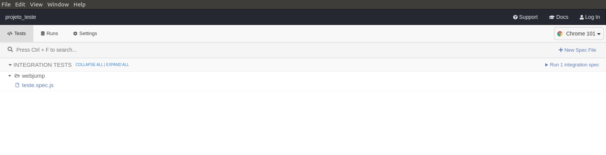
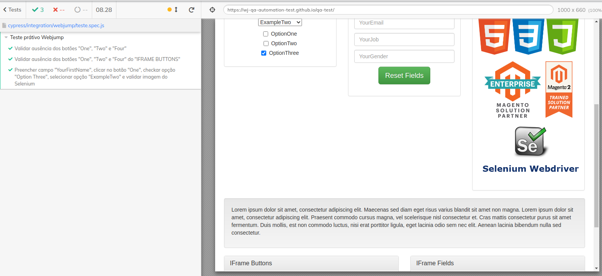

# Teste prático Webjump

## Versões
- NPM: 8.5.3
- Nodejs: 17.6.0
- JS: 13.14.0

## Sistema operacional
O SO utilizado no desenvolvimento do projeto foi o Ubuntu, versão 18.04.

## Instalação
**1. Clonar o projeto:** ```git clone git@github.com:EderCuer/teste_webjump.git```

**2. Instalar o Nodejs:** ```sudo apt-get install nodejs```

**3. Instalar o NPM:** ```sudo apt-get install npm```

**4. Na pasta do projeto, instalar o Cypress:** ```npm install cypress```


## Execução
**1. Na pasta do projeto, executar:** ```npm run cypress:open```

A página igual abaixo será aberta.


Após isso, clique no arquivo ```teste.spec.js```. O teste irá executar e ficará parecido com a imagem abaixo

